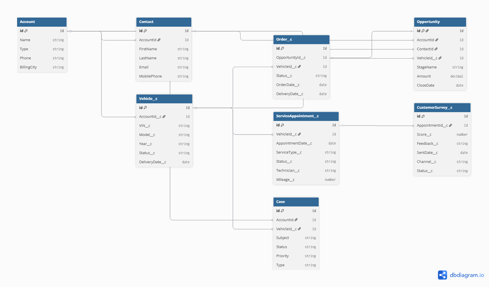

# Salesforce Automotive CRM

현대차그룹 완성차 CRM 프로세스를 Salesforce로 구현하는 개인 학습 프로젝트입니다.

## 목표

- 자동차 판매 / A/S / 고객관리 프로세스를 Salesforce 객체와 Apex로 구현
- Sales Cloud, Service Cloud 기반 고객 여정 설계
- 외부 시스템 연동 (API 기반 인터페이스 설계)

## 기술 스택

- **Salesforce**: Apex, LWC, SOQL
- **Cloud**: Sales Cloud, Service Cloud
- **Tools**: VS Code, Salesforce CLI, Git

## 데이터 모델 (ERD)

## 구현 범위

- 차량 판매 프로세스 (Lead → Opportunity → Order)
- A/S 접수 및 처리 (Case 관리)
- 고객 360° 뷰 (Account, Contact 통합)
- 외부 API 연동 (차량 정보 조회)
- 고객 만족도 자동 설문 발송 (Batch Apex)

## 프로젝트 구조
force-app/main/default/
├── classes/        # Apex 클래스
├── triggers/       # Apex Trigger
├── lwc/            # Lightning Web Component
├── objects/        # Custom Object 정의
└── flows/          # Flow 자동화

## 진행 상황

| 단계 | 내용 | 상태 |
|------|------|------|
| 1 | 데이터 모델 설계 (ERD) | ✅ 완료 |
| 2 | Custom Object 생성 | 🔄 진행 중 |
| 3 | Apex Trigger / Handler | ⏳ 예정 |
| 4 | Batch Apex (설문 발송) | ⏳ 예정 |
| 5 | LWC 고객 대시보드 | ⏳ 예정 |
| 6 | 외부 API 연동 | ⏳ 예정 |