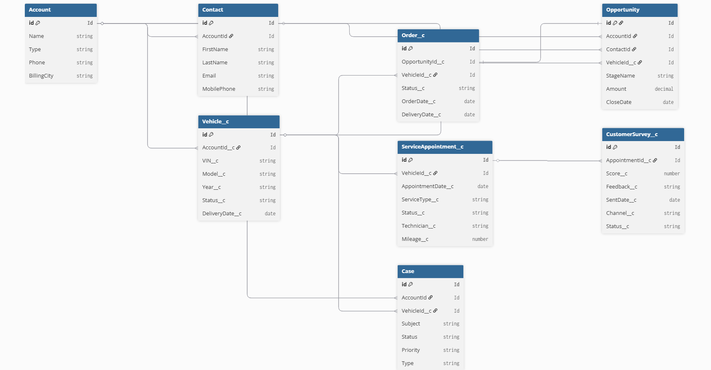

# Salesforce Automotive CRM

현대차그룹 완성차 CRM 프로세스를 Salesforce로 구현하는 개인 학습 프로젝트입니다.

## 프로젝트 배경

현대오토에버 Salesforce 컨설팅팀 재직자의 조언을 참고하여
실제 완성차 CRM 업무 프로세스를 기반으로 설계한 개인 학습 프로젝트입니다.

표준 오브젝트(Asset, Lead, Opportunity, Case)를 우선 활용하는 방향으로 설계했으나,
Developer Edition 환경 제약으로 일부 커스텀 오브젝트를 병행 사용했습니다.

## 프로젝트 소개 (PDF)

👉 [프로젝트 전체 소개 보기 (Google Drive)](https://drive.google.com/file/d/1BzB90kuOVY3lfWXqsXnRTvRhS4zd5f2C/view?usp=sharing)

## 개발 방식

현대오토에버에서도 사내 폐쇄망에서 Claude AI를 도입했다는 소식을 접하고,
이 프로젝트에서도 Claude를 페어 프로그래밍 파트너로 적극 활용했습니다.
설계 방향 검토, 코드 리뷰, 오류 디버깅 전 과정에서 AI와 협업했으며,
제안된 코드는 직접 이해하고 수정하여 Salesforce Org에 배포 및 동작을 확인했습니다.

## 기술 스택

- **Salesforce**: Apex, LWC, SOQL, ConnectAPI
- **Cloud**: Sales Cloud, Service Cloud
- **AI**: Einstein Prompt Builder, Claude Sonnet 4.6
- **Tools**: VS Code, Salesforce CLI, Git

## 데이터 모델 (ERD)

## 구현 기능

| 기능          | 설명                                                     |
| ------------- | -------------------------------------------------------- |
| Custom Object | Vehicle**c · ServiceAppointment**c · CustomerSurvey\_\_c |
| Apex Trigger  | 출고완료 시 담당자 Task 자동 생성 (Trigger Handler 패턴) |
| Batch Apex    | A/S 완료 7일 후 고객 설문 자동 발송 (200건 단위 처리)    |
| LWC Dashboard | vehicleDashboard 고객 차량 목록 실시간 조회              |
| Einstein AI   | Prompt Builder + ConnectAPI 연동 고객 피드백 자동 요약   |

## Governor Limit 대응

| 항목       | 대응 방식                                  |
| ---------- | ------------------------------------------ |
| SOQL 쿼리  | Trigger 내 SOQL 제거, Handler에서 Map 활용 |
| DML 구문   | List에 모아서 벌크 insert                  |
| Batch 처리 | 200건 단위 처리                            |

## 프로젝트 구조

    force-app/main/default/
    ├── classes/        # Apex 클래스
    ├── triggers/       # Apex Trigger
    ├── lwc/            # Lightning Web Component
    └── objects/        # Custom Object 정의

## 진행 상황

| 단계 | 내용                        | 상태    |
| ---- | --------------------------- | ------- |
| 1    | 데이터 모델 설계 (ERD)      | ✅ 완료 |
| 2    | Custom Object 생성 및 배포  | ✅ 완료 |
| 3    | Apex Trigger / Handler      | ✅ 완료 |
| 4    | Batch Apex (설문 자동 발송) | ✅ 완료 |
| 5    | LWC 고객 대시보드           | ✅ 완료 |
| 6    | Einstein AI 피드백 요약     | ✅ 완료 |
