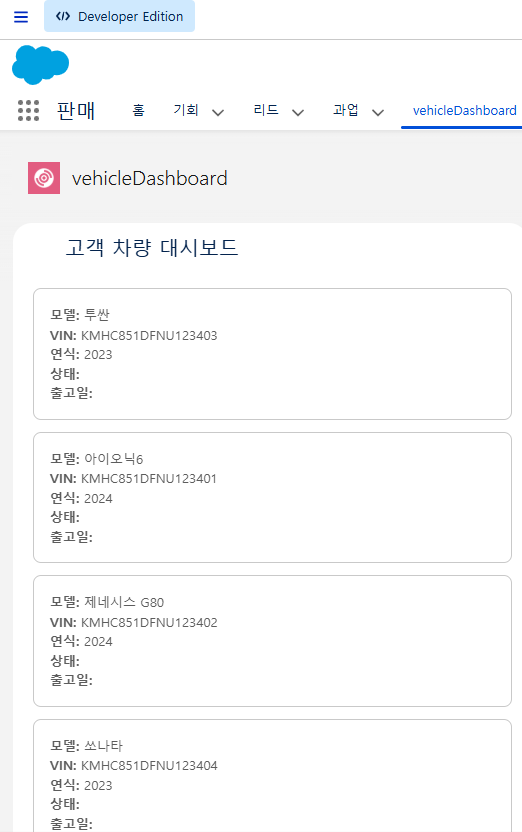
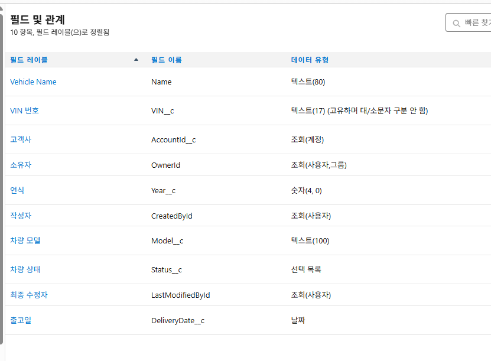
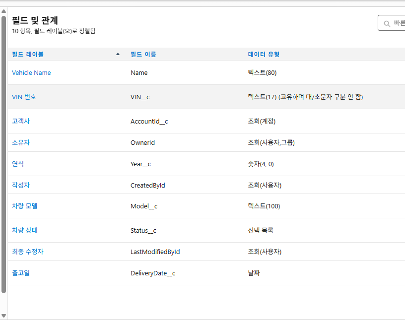
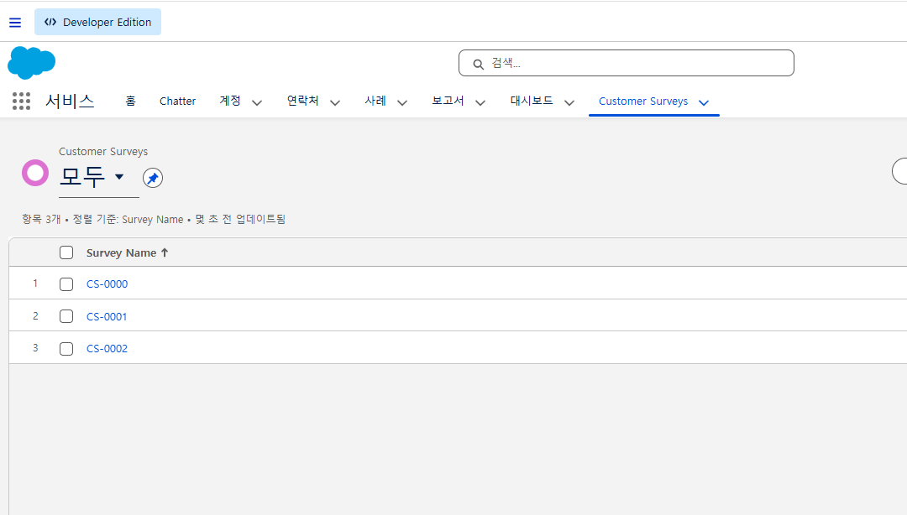
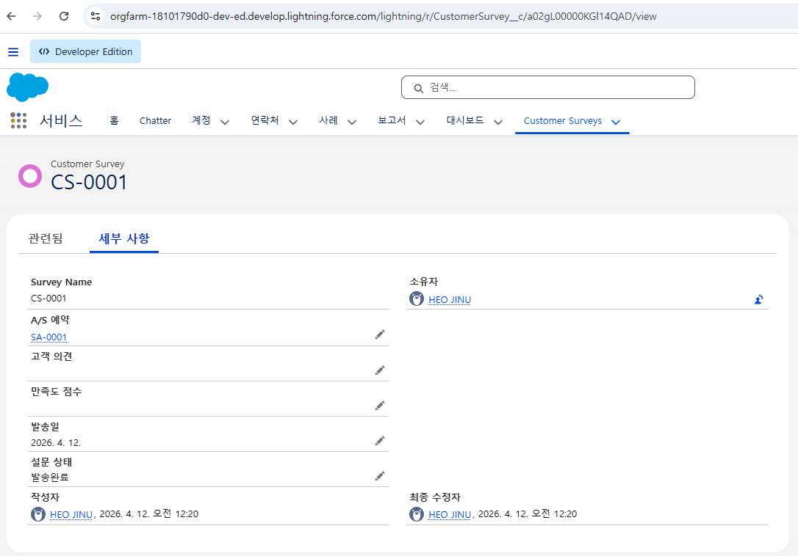
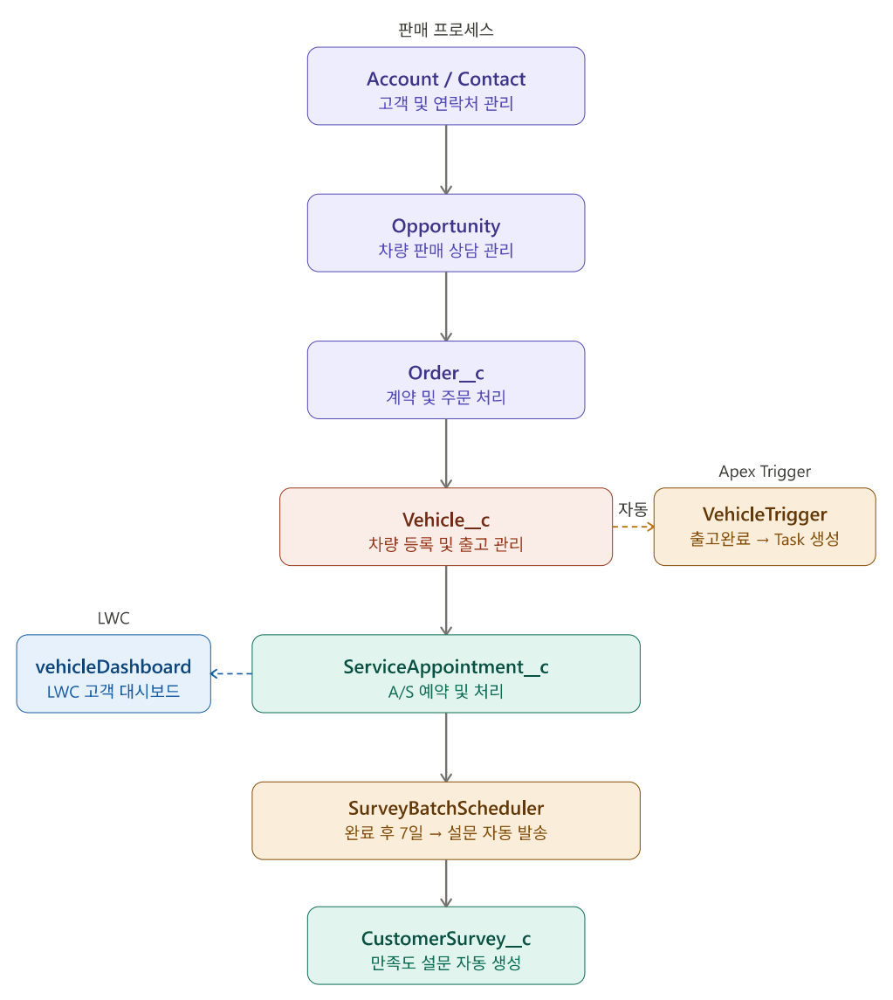

# Salesforce Automotive CRM

현대차그룹 완성차 CRM 프로세스를 Salesforce로 구현하는 개인 학습 프로젝트입니다.

## 프로젝트 배경

현대오토에버 Salesforce 컨설팅팀 재직자의 조언을 참고하여
실제 완성차 CRM 업무 프로세스를 기반으로 설계한 개인 학습 프로젝트입니다.

## 목표

- 자동차 판매 / A/S / 고객관리 프로세스를 Salesforce 객체와 Apex로 구현
- Sales Cloud, Service Cloud 기반 고객 여정 설계
- 외부 시스템 연동 (API 기반 인터페이스 설계)

## 기술 스택

- **Salesforce**: Apex, LWC, SOQL
- **Cloud**: Sales Cloud, Service Cloud
- **Tools**: VS Code, Salesforce CLI, Git

## 데이터 모델 (ERD)

## 구현 범위

- 차량 판매 프로세스 (Lead → Opportunity → Order)
- A/S 접수 및 처리 (Case 관리)
- 고객 360° 뷰 (Account, Contact 통합)
- 외부 API 연동 (차량 정보 조회)
- 고객 만족도 자동 설문 발송 (Batch Apex)

## 프로젝트 구조

    force-app/main/default/
    ├── classes/        # Apex 클래스
    ├── triggers/       # Apex Trigger
    ├── lwc/            # Lightning Web Component
    ├── objects/        # Custom Object 정의
    └── flows/          # Flow 자동화

## 진행 상황

| 단계 | 내용                   | 상태    |
| ---- | ---------------------- | ------- |
| 1    | 데이터 모델 설계 (ERD) | ✅ 완료 |
| 2    | Custom Object 생성     | ✅ 완료 |
| 3    | Apex Trigger / Handler | ✅ 완료 |
| 4    | Batch Apex (설문 발송) | ✅ 완료 |
| 5    | LWC 고객 대시보드      | ✅ 완료 |
| 6    | 외부 API 연동          | ⏳ 예정 |

## 기술적 의사결정

### Trigger Handler 패턴 적용

Trigger 로직을 `VehicleTriggerHandler` 클래스로 분리했습니다.
Trigger 파일에는 핸들러 호출만 남기고 실제 비즈니스 로직은 Handler 클래스에서 관리합니다.
이렇게 하면 여러 Trigger 이벤트(before insert, after update 등)가 발생해도
하나의 Handler에서 일관성 있게 처리할 수 있고, 단위 테스트 작성도 용이합니다.

### Batch Apex vs Future Method vs Queueable Apex

| 방식                | 선택 이유                                  |
| ------------------- | ------------------------------------------ |
| Trigger (즉시 실행) | 출고완료 시 Task 생성 — 실시간 처리 필요   |
| Batch Apex          | 설문 발송 — 대량 처리 + 스케줄링 필요      |
| Queueable Apex      | 외부 API 연동 예정 — 체이닝 및 비동기 처리 |

출고완료 Task 생성은 즉각적인 피드백이 필요한 작업이라 Trigger를 사용했고,
설문 발송은 매일 대량으로 처리해야 하므로 스케줄링이 가능한 Batch Apex를 선택했습니다.

## Governor Limit 대응 전략

Salesforce는 단일 트랜잭션에서 사용할 수 있는 리소스에 제한(Governor Limit)을 둡니다.
이 프로젝트에서 적용한 대응 방식은 다음과 같습니다.

| 항목            | 제한             | 대응 방식                                                |
| --------------- | ---------------- | -------------------------------------------------------- |
| SOQL 쿼리       | 트랜잭션당 100회 | Trigger 내 SOQL 제거, Handler에서 Map 활용               |
| DML 구문        | 트랜잭션당 150회 | List에 모아서 단건이 아닌 벌크로 insert                  |
| Batch 처리 단위 | 200건            | `Database.executeBatch(new SurveyBatchScheduler(), 200)` |

## 화면 및 동작 확인

### 고객 차량 대시보드 (LWC)

### Vehicle 오브젝트 필드 구조

### Apex 클래스 목록

### 고객 만족도 설문 목록

### 설문 상세 화면 (Batch 자동 생성)

## 시스템 아키텍처

